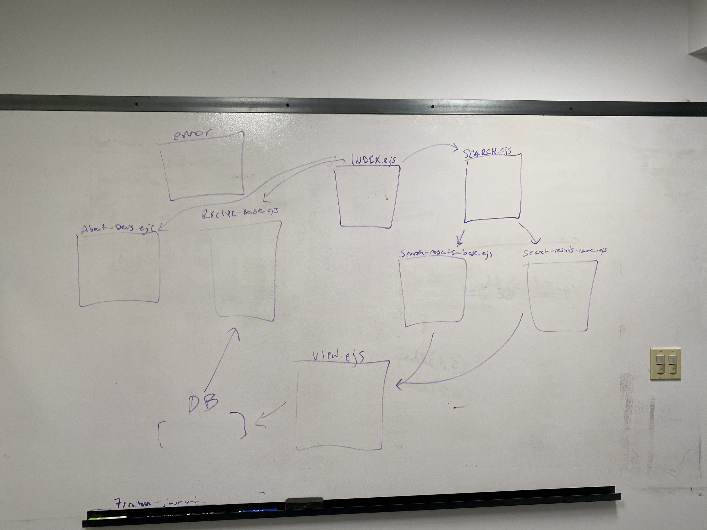

# BartenderApp

**Author**: Bryan Tran, Sam Thurman, Kai McConnell - Group Project
**Version**: 1.0.0 
**How to Access App**
https://km-bt-st-bartender.herokuapp.com/

## Overview
This app uses the Cocktail Db API to request information on various cocktails and recipes, and streamlines the process to allow the user to efficiently search for information they want that is available in the database. The User may search for cocktails via the name of the cocktail or search for various cocktails via their base liquor. The user may also save their favorite recipes in their recipe book, which will be supported via a SQL databse. 

## Domain Model

## Getting Started
1. Clone the repo from the Github.
2. Run it on localhost or deploy it from Heroku.
3. Enjoy the app.

## Architecture
This app uses cors, express, superagent, ejs, method-override, and dotenv as dependencies. The language used for code is HTML, CSS, JavaScript, JQuery, and SQL. This app uses an SQL database. 

## Change Log

12/26/2019 12:00am - Created SQL database for server

12/26/2019 3:30pm - Finished SearchByBase implementation

12/26/2019 4:30pm - Finished SearchByName implementation

12/27/2019 11:00am - Finished InsertIntoDatabase implementation

12/27/2019 11:15am - Finished DeleteFromDatabase implementation

12/29/2019 11:00pm - Finished LoginHandler implementation

12/29/2019 11:00pm - Finished CreateIndividualList implementation

12/30/2019 12:00pm - Finished NavBar Implementation

12/30/2019 1:00pm - Finished Multi-Search Implementation

## Credits and Collaborations
Cocktail Db for their API.

## Features and Time

Number and name of feature: Implementing SearchByBase

Estimate of time needed to complete: 1 hour 30 minutes

Start time: 1:00pm

Finish time: 3:30pm

Actual time needed to complete: 2 hours 30 minutes

Number and name of feature: Implementing SearchByName

Estimate of time needed to complete: 1 hour 30 minutes

Start time: 3:30pm

Finish time: 4:00pm

Actual time needed to complete: 1 hour

Number and name of feature: Insert into Database

Estimate of time needed to complete: 1 hour

Start time: 10:30am

Finish time: 11:00am

Actual time needed to complete: 30 minutes

Number and name of feature: Delete from Database

Estimate of time needed to complete: 1 hour

Start time: 11:00am

Finish time: 11:15am

Actual time needed to complete: 15 minutes

Number and name of feature: Navbar

Estimate of time needed to complete: 1 hour

Start time: 11:30am

Finish time: 11:55am

Actual time needed to complete: 25 minutes

Number and name of feature: Modularization of Files

Estimate of time needed to complete: 1 hour

Start time: 5:00pm

Finish time: 7:00pm

Actual time needed to complete: 2 hours

Number and name of feature: Login Handler

Estimate of time needed to complete: 1 hour 30 minutes

Start time: 5:00pm

Finish time: 6:00pm

Actual time needed to complete: 1 hour

Number and name of feature: Cocktail List

Estimate of time needed to complete: 2 hours

Start time: 6:00pm

Finish time: 11:00pm

Actual time needed to complete: 5 hour

Number and name of feature: Multi-Search

Estimate of time needed to complete: 1 hour

Start time: 11:00pm

Finish time: 1:00pm

Actual time needed to complete: 2 hours

Number and name of feature: NavBar

Estimate of time needed to complete: 1 hour

Start time: 11:00pm

Finish time: 12:00pm

Actual time needed to complete: 1 hours

Number and name of feature: Update cocktails

Estimate of time needed to complete: 2 hours

Start time: 10:00am

Finish time: 12:15pm

Actual time needed to complete: 2 hours and 15 minutes

Number and name of feature: About Page

Estimate of time needed to complete: 30 minutes

Start time: 12:00pm

Finish time: 12:30pm

Actual time needed to complete: 30 minutes
